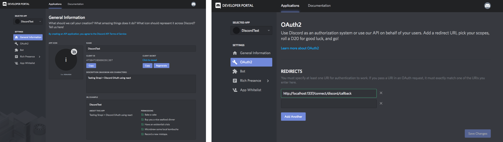
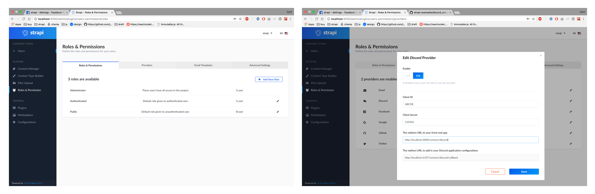
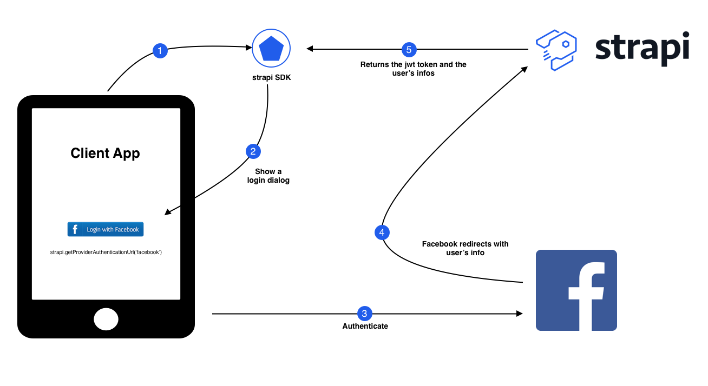
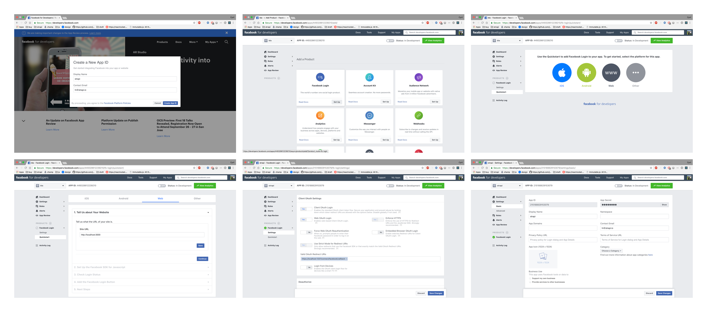
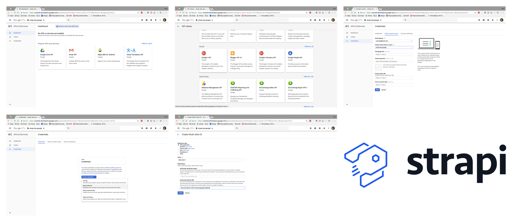
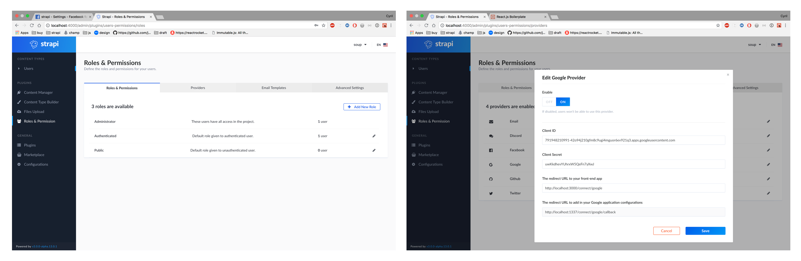
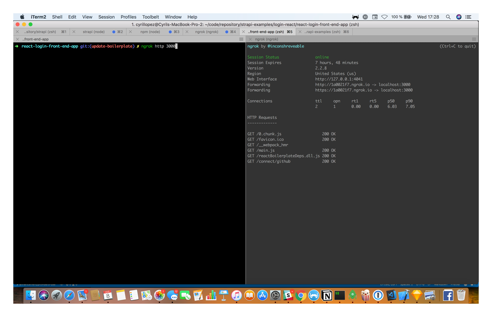
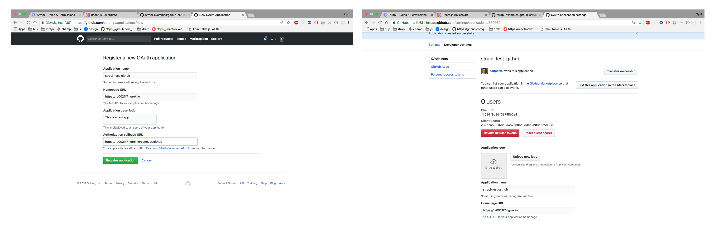

# Authentication

> ⚠️  This feature requires the Users & Permissions plugin (installed by default).

## Register a new user

This route lets you create new users.

#### Usage

```js
$.ajax({
  type: 'POST',
  url: 'http://localhost:1337/auth/local/register',
  data: {
    username: 'Strapi user',
    email: 'user@strapi.io',
    password: 'strapiPassword'
  },
  done: function(auth) {
    console.log('Well done!');
    console.log('User profile', auth.user);
    console.log('User token', auth.jwt);
  },
  fail: function(error) {
    console.log('An error occurred:', error);
  }
});
```

## Login.

This route lets you login your users by getting an authentication token.

#### Local

- The `identifier` param can either be an email or a username.

```js
$.ajax({
  type: 'POST',
  url: 'http://localhost:1337/auth/local',
  data: {
    identifier: 'user@strapi.io',
    password: 'strapiPassword'
  },
  done: function(auth) {
    console.log('Well done!');
    console.log('User profile', auth.user);
    console.log('User token', auth.jwt);
  },
  fail: function(error) {
    console.log('An error occurred:', error);
  }
});
```

## Providers

Thanks to [Grant](https://github.com/simov/grant) and [Purest](https://github.com/simov/purest), you can easily use OAuth and OAuth2
providers to enable authentication in your application. By default,
Strapi comes with the following providers: 
- [Discord](#enabling-discord-provider) 
- [Facebook](#enabling-facebook-provider)
- [Google](#enabling-google-provider)
- [Github](#enabling-github-provider)
- [Twitter](https://github.com/strapi/strapi-examples/blob/master/login-react/doc/twitter_setup.md)

[👀   See our complete example with detailed tutorials for each provider (with React)](https://github.com/strapi/strapi-examples/tree/master/login-react)


---

To use the providers authentication, set your credentials in the admin interface (Plugin Users & Permissions > Providers).
Then update and enable the provider you want use.

Redirect your user to: `GET /connect/:provider`. eg: `GET /connect/facebook`

After his approval, he will be redirected to `/auth/:provider/callback`. The `jwt` and `user` data will be available in the body response.

Response payload:

```js
{
  "user": {},
  "jwt": ""
}
```

## Use your token to be identified as a user.

By default, each API request is identified as `guest` role (see permissions of `guest`'s role in your admin dashboard). To make a request as a user, you have to set the `Authorization` token in your request headers. You receive a 401 error if you are not authorized to make this request or if your authorization header is not correct.

#### Usage

- The `token` variable is the `data.jwt` received when login in or registering.

```js
$.ajax({
  type: 'GET',
  url: 'http://localhost:1337/article',
  headers: {
    Authorization: `Bearer ${token}`
  },
  done: function(data) {
    console.log('Your data', data);
  },
  fail: function(error) {
    console.log('An error occurred:', error);
  }
});
```

## Send forgot password request.

This action sends an email to a user with the link of you reset password page. This link contains an URL param `code` which is required to reset user password.

#### Usage

- `email` is your user email.
- `url` is the url link that user will receive.

```js
$.ajax({
  type: 'POST',
  url: 'http://localhost:1337/auth/forgot-password',
  data: {
    email: 'user@strapi.io',
    url: 'http://mon-site.com/rest-password'
  },
  done: function() {
    console.log('Your user received an email');
  },
  fail: function(error) {
    console.log('An error occurred:', error);
  }
});
```

> Received link url format http://mon-site.com/rest-password?code=privateCode

## Reset user password.

This action will reset the user password.

#### Usage

- `code` is the url params received from the email link (see forgot password)

```js
$.ajax({
  type: 'POST',
  url: 'http://localhost:1337/auth/reset-password',
  data: {
    code: 'privateCode',
    password: 'myNewPassword',
    passwordConfirmation: 'myNewPassword'
  },
  done: function() {
    console.log('Your user password is reset');
  },
  fail: function(error) {
    console.log('An error occurred:', error);
  }
});
```

## User Object In Strapi Context
The User object is available to successfully authenticated requests.

#### Usage
- The authenticated `user` object is a property of `ctx.state`.


```js
  create: async (ctx) => {

    const { _id } = ctx.state.user

    const depositObj = {
      ...ctx.request.body,
      depositor: _id
    }

    const data = await strapi.services.deposit.add(depositObj);

    // Send 201 `created`
    ctx.created(data);
  }

```


## Email templates

[See the documentation on GitHub](https://github.com/strapi/strapi/blob/master/packages/strapi-plugin-users-permissions/docs/email-templates.md)


## Enabling Discord Provider

Go to the [Discord developers](https://discordapp.com/developers/applications/) and create an app.

Under OAuth2, add the redirect `http://localhost:1337/connect/discord/callback`




### Strapi Setup

[Go to the Admin](http://localhost:1337/admin/plugins/users-permissions/providers), enable Discord and enter your credentials.




> If you are using the [login-react boilerplate](https://github.com/strapi/strapi-examples/blob/master/login-react) go to localhost:3000 and try to sign up with discord.

---

## Enabling Facebook Provider

### Login Flow



### Facebook Setup

To enable Facebook login you need to :
- Go to the facebook's [developers platform](https://developers.facebook.com/), create a new app and add the facebook login API, and choose the WEB platform.
- Add the login API
- Select the Web platform
- Fill your front-end app URL
- Under the settings tab set your `Valid OAuth Redirect URIs`, in development you need to fill `https://localhost:1337/connect/facebook/callback`




Once the Facebook setup part is completed you need to enable the provider in your Strapi project.

### Strapi Setup

- Launch your strapi server : `cd my-awesome-project && strapi start` and go to `http://localhost:1337/admin/plugins/users-permissions/providers`
- Click on the Facebook provider and fill the informations :
  - Client ID
  - Client secret
  - The redirect URL to your front-end app, if you are using the [login-react boilerplate](https://github.com/strapi/strapi-examples/blob/master/login-react) it should be `http://localhost:3000/connect/facebook`
- Save your settings


> If you are using the [login-react boilerplate](https://github.com/strapi/strapi-examples/blob/master/login-react) go to localhost:3000 and try to sign up with Facebook.

---

## Enabling Google Provider

### Google Setup

- Go to the [Google developers console](https://console.developers.google.com/) and create a project.
- In your app's dashboard click on the `ENABLE API AND SERVICES` button
- Select the `Google +` API and enable it
- Then, click on the credentials tab and click on the `Credentials in APIs & Services` link and configure your `consent screen`.
- Then in the `Create OAuth client ID` screen select the `Web application` option and fill the 
`Authorized redirect URIs` with `http://localhost:1337/connect/google/callback` (if you are in development mode).




### Strapi setup

- Launch your strapi server : `cd my-awesome-project && strapi start` and go to `http://localhost:1337/admin/plugins/users-permissions/providers`
- Click on the Google provider and fill the informations :
  - Client ID
  - Client secret
  - The redirect URL to your front-end app, if you are using the [login-react boilerplate](https://github.com/strapi/strapi-examples/blob/master/login-react) it should be `http://localhost:3000/connect/google`
- Save your settings



> If you are using the [login-react boilerplate](https://github.com/strapi/strapi-examples/blob/master/login-react) go to localhost:3000 and try to sign up with google.


---

## Enabling Github Provider


### Github Setup

> The documentation provided for this provider is made for [login-react boilerplate](https://github.com/strapi/strapi-examples/blob/master/login-react) but it should work the same for any other front-end app.

Before setting up GitHub as a provider you'll need to install [ngrok](https://ngrok.com/2) because GitHub doesn't allow URLS from `localhost`.

- Launch the [login-react boilerplate](https://github.com/strapi/strapi-examples/blob/master/login-react) server `cd react-login-front-end-app && npm start`
- In your terminal open a ngrok tunnel by running `ngrok http 3000`.



- Go to [GitHub](https://github.com/settings/applications/new) and create a new app.




### Strapi Setup

- Launch your strapi server : `cd my-awesome-project && strapi start` and go to `http://localhost:1337/admin/plugins/users-permissions/providers`
- Click on the Google provider and fill the informations :
  - Client ID
  - Client secret
  - The redirect URL to your front-end app, if you are using the [login-react boilerplate](https://github.com/strapi/strapi-examples/blob/master/login-react) it should be `YOUR_NGROK_URL/connect/github`
- Save your settings


> If you are using the [login-react boilerplate](https://github.com/strapi/strapi-examples/blob/master/login-react) go to localhost:3000 and try to sign up with GitHub.
